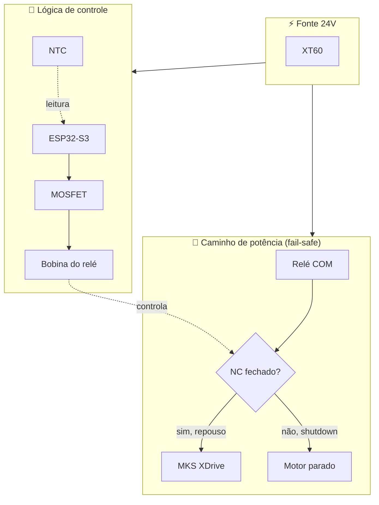

# RS50 Thermal Controller — Context

> Documento de contexto para retomar o projeto rapidamente em sessões
> futuras (com humano ou IA). Last update: 2026-05-06.

## 🎯 Objetivo

Controle térmico **fail-safe** para um volante RS50 modificado com motor
BLDC de hoverboard (15Nm) acionado por uma placa MKS XDrive Mini 1.0
(firmware ODESC FFBeast). Quando a temperatura do motor passa de 68°C,
o sistema corta a alimentação +24V da MKS e força a parada segura.

## 🧠 Decisões de hardware (fechadas)

| Item | Escolha | Razão |
|---|---|---|
| MCU | ESP32-S3-Zero (Waveshare) | Tamanho, Wi-Fi/BLE pra telemetria futura |
| Sensor de temperatura | NTC 100k B3950 (encapsulado de vidro) | Encosta direto no estator |
| Atuador | Relé Songle SLA-24VDC-SL-C (NC, SPDT, 30A) | Fail-safe natural: sem energia → motor liga |
| Driver do relé | IRLZ44N (logic-level N-MOSFET) | Vgs(th) baixo, dirige direto do GPIO 3.3V |
| Proteção do MOSFET | 1N4007 em paralelo com a bobina | Flyback do indutivo |
| Reguladores | 2× HW-411 (LM2596) em cascata | 24→12V (fan) e 12→5V (lógica) |
| Fan | 120mm 4-pin PWM nativo | PWM 3.3V direto do GPIO5 |
| Status visual | WS2812 (1, 3 ou 5 LEDs) | Codinas de cor por temperatura/estado |

## 🧩 Topologia fail-safe

- **+24V** da fonte vai pro **COM** do relé.
- Em repouso, contato **COM↔NC fechado** → MKS recebe 24V → motor funciona.
- Quando ESP comanda shutdown, bobina energiza → NC abre → motor para.
- **GND vai direto** da fonte para a MKS (não passa pelo relé).
- Se ESP travar / cair fonte de 5V / código bugar → relé volta pra NC
  fechado → motor continua funcionando (não é o pior caso).
- Se a fonte de 24V cair → tudo desliga junto (caso obviamente seguro).

## 🔌 Pinout do ESP32-S3-Zero

| GPIO | Função | Notas |
|---|---|---|
| 1 | NTC ADC (entrada) | Divisor com 100k pull-up para 3V3 + cap 100nF |
| 4 | Gate do MOSFET (saída) | 220Ω série + 10k pull-down para GND |
| 5 | PWM Fan (saída) | 25kHz, lógica 3.3V direto |
| 9 | WS2812 Data (saída) | 330Ω série, depois do qual o strip aceita |
| 21 | (NÃO USAR) | LED RGB onboard, conflita |

## 🛡 Limites e thresholds

- **Cooler liga** progressivamente a partir de 40°C (PWM rampa).
- **Cooler 100%** a partir de 60°C.
- **Shutdown térmico** em **68°C** (histerese de 5°C para religar a 63°C).
- Filtro digital (média móvel + rejeição de outlier) na leitura do NTC.

## 🧪 Procedimentos de validação

1. **Bancada sem motor**: simular NTC com potenciômetro e validar
   transições de estado nos LEDs WS2812.
2. **Multímetro no gate** durante shutdown: deve ir de 0V → ~3.3V e
   relé deve clicar audivelmente.
3. **Multímetro no NC do relé** com motor desligado: deve ter +24V
   em repouso e 0V durante shutdown.
4. **Modo diodo no multímetro** para validar o 1N4007 antes de soldar
   (~0.6V direto, OL reverso).

## ❌ O que NÃO está no escopo

- Comunicação com a MKS via UART (apenas corte físico).
- Telemetria via Wi-Fi (planejado para v4.x).
- Carcaça/case (só PCB e fiação por enquanto).

### Visão arquitetural

