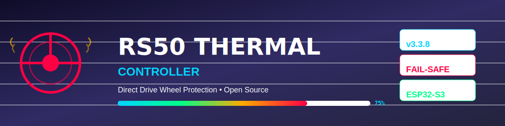
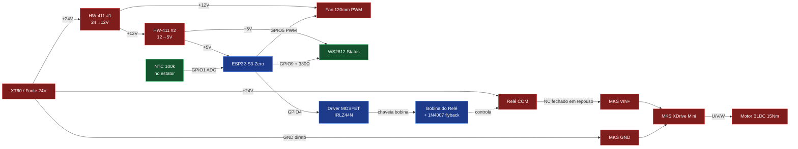
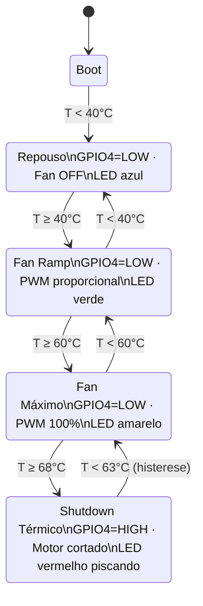
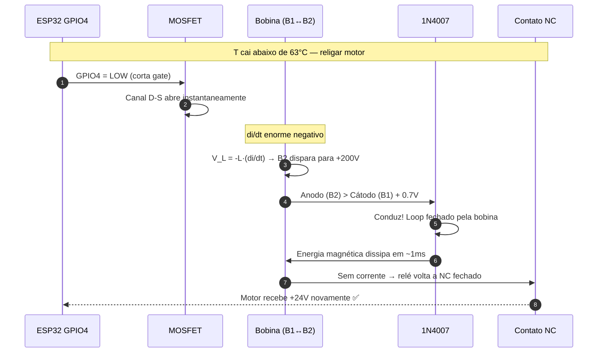

<p align="center">
  
</p>

<p align="center">
  <a href="https://github.com/Jean-DrEaD/rs50-thermal-controller/releases/latest">
    
  </a>
  <a href="https://github.com/Jean-DrEaD/rs50-thermal-controller/actions">
    
  </a>
  
  
</p>

# RS50 Thermal Controller

Controle térmico **fail-safe** para volante RS50 modificado com motor BLDC
de hoverboard (15Nm) acionado por placa MKS XDrive Mini 1.0
(firmware ODESC FFBeast).

> 🛡 **Filosofia do projeto:** se algo der errado no controlador térmico,
> o motor continua funcionando. O corte só acontece quando o sistema
> conscientemente decide cortar.


> 📐 Diagrama de breadboard exportado do Fritzing — mostra o layout físico real da montagem.
> Para o detalhamento lógico do circuito, ver os diagramas Mermaid abaixo.

## ✨ Features

- 🌡 Leitura de temperatura via NTC 100k B3950 encostado no estator.
- 🛑 Shutdown automático do motor em **T ≥ 68°C** com histerese.
- 💨 Fan 120mm com PWM proporcional à temperatura.
- 💡 LEDs WS2812 indicando estado do sistema.
- 🔒 Topologia **fail-safe**: relé NC isola apenas o +24V da MKS.
- ⚡ Diodo flyback protegendo o MOSFET contra spikes indutivos.

## 🧩 Hardware (BOM)

| Qtd | Componente | Notas |
|---|---|---|
| 1 | ESP32-S3-Zero (Waveshare) | MCU principal |
| 1 | Songle SLA-24VDC-SL-C | Relé NC SPDT 30A |
| 1 | IRLZ44N | MOSFET logic-level |
| 1 | 1N4007 | Diodo flyback |
| 2 | HW-411 (LM2596) | Reguladores DC-DC |
| 1 | NTC 100k B3950 | Encapsulado de vidro |
| 1 | Fan 120mm 12V 4-pin PWM | — |
| 1 | WS2812 strip (1–5 LEDs) | Status visual |
| — | Resistores | 220Ω, 10k, 100k, 330Ω |
| — | Capacitor | 100nF (filtro NTC) |
| 1 | Conector XT60 | Entrada de 24V |

## 🗺 Diagrama de blocos



## 🔁 Fluxo de operação

### Estado 1 — Repouso (operação normal)

`GPIO4 = LOW` → MOSFET OFF → bobina sem corrente → relé em **NC fechado** → MKS recebe +24V → **motor OK** ✅

### Estado 2 — Shutdown térmico (T ≥ 68°C)

`GPIO4 = HIGH` → MOSFET ON → bobina energiza → relé comuta (**NC abre**) → MKS perde +24V → **motor para** 🛑

### Estado 3 — Volta ao normal (T cai abaixo de 63°C)

`GPIO4 = HIGH → LOW` → MOSFET corta abruptamente → bobina gera **spike indutivo** no Drain → diodo 1N4007 conduz e dissipa a energia magnética → MOSFET protegido → relé volta para NC fechado.

### Máquina de estados



## ⚡ Como funciona o flyback diode (1N4007)

A bobina do relé é um **indutor**: armazena energia no campo magnético
quando há corrente. Pela lei de Lenz, um indutor **não permite mudanças
abruptas de corrente** — quando o MOSFET corta, a bobina inverte sua
polaridade e tenta empurrar a corrente para frente, gerando um spike de
centenas de volts no Drain.

O diodo flyback fornece um **caminho de retorno** para essa corrente:

```
        B1 ─────────────── B2
      (+24V)            (Drain)
        │                  │
        ▌◄─── 1N4007 ──────▶
      cátodo              anodo
      (faixa)
```

- **Em operação normal** (MOSFET ON ou OFF estável): diodo em polarização
  reversa, **não conduz**.
- **No instante do desligamento**: B2 sobe acima de B1 + 0,7V, o diodo
  entra em condução e a corrente da bobina circula em **loop fechado**,
  dissipando a energia em poucos ms.
- O MOSFET nunca vê mais que ~24,7V no Drain. ✅

### Regra de ouro

> **Cátodo (faixa) sempre no lado +24V fixo, anodo no lado chaveado.**
>
> Mnemônico: **K = Katodo = faixa**.

### Sequência temporal do flyback



## 🔌 Pinout

| GPIO | Função | Notas |
|---|---|---|
| 1 | NTC ADC | Divisor 100k + cap 100nF |
| 4 | Gate MOSFET | 220Ω série + 10k pull-down |
| 5 | PWM Fan | Lógica 3.3V direto |
| 9 | WS2812 Data | 330Ω série |

> ⚠️ **Não usar GPIO21**: é o LED RGB onboard do ESP32-S3-Zero.

## 🧪 Procedimento de validação

1. **Antes de ligar a fonte de 24V** pela primeira vez, conferir o diodo
   1N4007 com o multímetro em modo diodo:
   - Vermelho no anodo, preto no cátodo → mostra ~0,6V (silício).
   - Inverso → OL (open loop).
2. **Bancada sem motor**: substituir o NTC por um potenciômetro 100k e
   validar todas as transições de estado.
3. **Multímetro no NC do relé** com motor parado:
   - Em repouso: ~+24V.
   - Durante shutdown: ~0V.
4. **Multímetro no Gate do MOSFET** durante shutdown:
   - Repouso: 0V.
   - Shutdown: ~3,3V.
   - Relé deve clicar audivelmente.

## 📂 Estrutura do repositório

```
.
├── README.md                  ← visão geral + diagramas Mermaid + banner
├── CHANGELOG.md               ← histórico (Keep a Changelog)
├── CONTEXT.md                 ← diário de sessão
├── docs/
│   ├── banner.svg             ← banner do projeto (usado no README)
│   └── wiring-schematic.svg
├── src/
│   └── rs50_thermal/
│       ├── rs50_thermal.ino   ← firmware principal
│       ├── config.h           ← FW_VERSION + macros (NÃO COMMITAR)
│       ├── config.h.example   ← template público
│       └── dashboard.h        ← HTML/CSS/JS do dashboard web
├── tools/
│   ├── flash_ota.sh           ← OTA upload (Linux/macOS/WSL)
│   └── flash_ota.ps1          ← OTA upload (Windows/PowerShell)
├── hardware/                  ← KiCad PCB (sem planos ativos no v3.x)
└── .github/
    └── workflows/             ← CI (Arduino Build & Validate + Release Build)

```

## 📜 Licença

MIT — use, modifique, redistribua. Sem garantias.

## 🙏 Agradecimentos

- Comunidade ODESC FFBeast pelo firmware da MKS.
- Fritzing pela ferramenta de prototipagem.
- Todos os tutoriais sobre flyback diodes que finalmente fizeram sentido. 🤝

